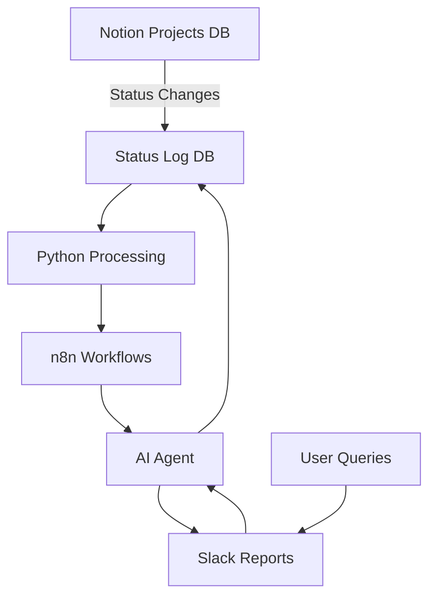

# AI Status Reporter 🚀

[](https://www.anthropic.com/claude)
[](https://www.python.org/)
[](https://n8n.io/)
[](https://developers.notion.com/)
[](https://api.slack.com/)

An intelligent project status tracking and reporting system that monitors Notion databases for status changes, generates automated reports, and provides AI-powered natural language queries through Slack.

> 🤖 **This repository is maintained and enhanced by Claude AI Code Agent through GitHub Actions automation**

## 🌟 Features

### Core Capabilities
- **🔄 Automated Status Tracking**: Real-time monitoring of project status changes in Notion
- **📊 Smart Reporting**: Weekly and monthly digest reports with AI-generated insights
- **🤖 AI Query Agent**: Natural language queries in Slack powered by Claude Sonnet (AWS Bedrock)
- **🧹 Data Retention**: Automated 1-month retention policy with cleanup workflows
- **🌍 Multi-language Support**: Full Ukrainian language support for reports and queries

### Technical Highlights
- **Dual Development Approach**: Python for R&D, n8n for production workflows
- **Comprehensive Testing**: Verified outputs between Python and n8n implementations
- **Modular Architecture**: Clean separation of concerns with specialized modules
- **Enterprise Integration**: Notion API, Slack API, AWS Bedrock

## 🏗️ Architecture



## 📦 Project Structure

```
ai-status-reporter/
├── src/                          # Core Python modules
│   ├── status_log_processor.py  # Main orchestrator
│   ├── query_status_log.py      # Database interface
│   ├── aggregate_reports.py     # Data aggregation
│   ├── report_generator.py      # Slack formatting
│   ├── ai_raw_data_feed.py      # AI data provider
│   ├── retention_manager.py     # Cleanup logic
│   └── n8n_workflows/            # Production workflows
├── test_outputs/                 # Test verification
├── .github/                      # GitHub Actions
└── pyproject.toml               # Dependencies
```

## 🚀 Getting Started

### Prerequisites
- Python 3.11+
- Notion API access
- Slack workspace
- n8n instance
- AWS Bedrock (for Claude AI)

### Installation

1. Clone the repository:
```bash
git clone https://github.com/xliberty2008x/ai-status-reporter.git
cd ai-status-reporter
```

2. Install dependencies:
```bash
pip install -r requirements.txt
```

3. Set up environment variables:
```bash
python setup_environment.py
```

4. Configure your `.env` file:
```env
NOTION_API_KEY=your_notion_api_key
NOTION_DATABASE_ID=your_database_id
NOTION_ALL_PROJECTS_ID=your_projects_database_id
SLACK_BOT_TOKEN=your_slack_token
AWS_ACCESS_KEY_ID=your_aws_key
AWS_SECRET_ACCESS_KEY=your_aws_secret
CLAUDE_MODEL_ID=anthropic.claude-3-sonnet
```

## 💻 Usage

### Command Line Interface

```bash
# Check system health
python src/status_log_processor.py status

# Generate weekly report
python src/status_log_processor.py weekly

# Generate monthly report
python src/status_log_processor.py monthly

# Prepare AI context
python src/status_log_processor.py ai-context

# Answer natural language questions
python src/status_log_processor.py question "Show me all projects in QA status"

# Run retention cleanup
python src/status_log_processor.py cleanup
```

### Slack Commands

In your Slack channel `#project-status-update`:

```
@ai-agent Show me all projects that moved to LIVE this week
@ai-agent What's the status of iOS projects?
@ai-agent Which teams had the most status changes?
@ai-agent help
```

## 🔄 n8n Workflows

### Available Workflows

1. **`clean_log_previous_month.json`**
   - Runs daily at 23:00 UTC
   - Checks for last day of month
   - Removes records older than 1 month

2. **`report_previous_week_month.json`**
   - Weekly: Every Monday at 9 AM
   - Monthly: Last day of month at 10 AM
   - Generates comprehensive reports with AI insights

3. **`ai_agent_track_statuses_enhanced.json`**
   - Real-time Slack integration
   - Natural language processing
   - Dynamic Notion filtering
   - Conversation memory

## 🧪 Testing

The project includes comprehensive testing to ensure Python and n8n outputs match exactly:

```bash
# Generate test data
python src/test_mockup_generation.py

# Verify outputs match
python src/verify_outputs.py

# Test specific module
python src/verify_outputs.py weekly_report
```

## 📊 Supported Status Transitions

### Status Categories
- **To Do**: BACKLOG
- **In Progress**: GD CTR TEST, CTR TEST, DEVELOPMENT, QA, RELEASE POOL
- **Complete**: LIVE, UA, AUTO UA, PAUSED, ARCHIVE

### Tracked Platforms
- GP (Google Play)
- AMZ (Amazon)
- iOS
- Fire TV

## 🤖 AI Integration

The system uses Claude 3 Sonnet (via AWS Bedrock) for:
- Natural language query understanding
- Report generation with data insights
- Ukrainian/English language processing
- Dynamic filter generation for Notion queries

## 🔐 Security

- All sensitive data stored in environment variables
- API keys never committed to repository
- Secure integration with enterprise APIs
- Automated cleanup of old data

## 📈 Performance

- Batch processing for large datasets
- Efficient Notion API usage
- Optimized n8n workflow execution
- Minimal overhead for daily operations

## 🛠️ Development Methodology

This project follows a unique dual-track development approach:

1. **Python = R&D Laboratory**
   - Local development and testing
   - Algorithm validation
   - Logic discovery

2. **n8n = Production Environment**
   - Native node implementation
   - Self-contained workflows
   - Production-ready automation

## 🤝 Contributing

This repository is maintained by Claude AI Code Agent through automated GitHub Actions. For contributions or issues, please open a GitHub issue.

## 📝 License

This project is part of a private portfolio. All rights reserved.

## 🙏 Acknowledgments

- Built with Claude AI assistance
- Powered by n8n automation platform
- Integrated with Notion and Slack APIs
- Enhanced by AWS Bedrock AI services

## 📞 Contact

For questions or collaboration opportunities, please reach out through GitHub issues.

---

*Last Updated: January 2025*
*Maintained by Claude AI Code Agent via GitHub Actions*
